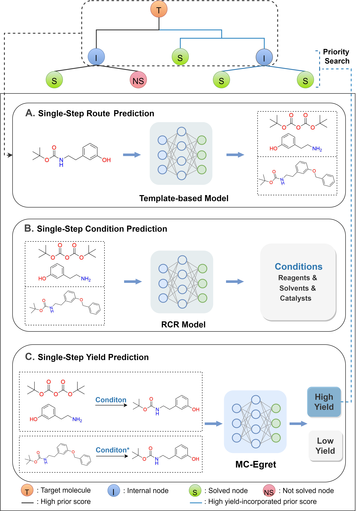

# yield-score-analysis
Yield-Incorporated Synthesis Planning Analysis



## Installation Guide
```
git clone https://github.com/xiaodanyin/yield-score-analysis.git
cd yield-score-analysis
conda env create -f envs.yaml
conda activate yield_az_score_env
cd aizynthfinder
pip install -e .
```
## Run
```
cd aizynthfinder/aizynthfinder/interfaces
python aizynthcli.py --smiles ../../contrib/data/test_data/smiles.txt \
                     --config ../../contrib/data/config.yml \
                     --policy uspto \
                     --stocks zinc
```
## Results Analysis
```
python aizynthfinder/contrib/scripts/analysis_routs.py
```
## Download
The models can be downloaded from the following link: https://drive.google.com/file/d/1ezC9nmTDX9LGvE85J1oaqbV1_kJ2e2OH/view?usp=sharing.